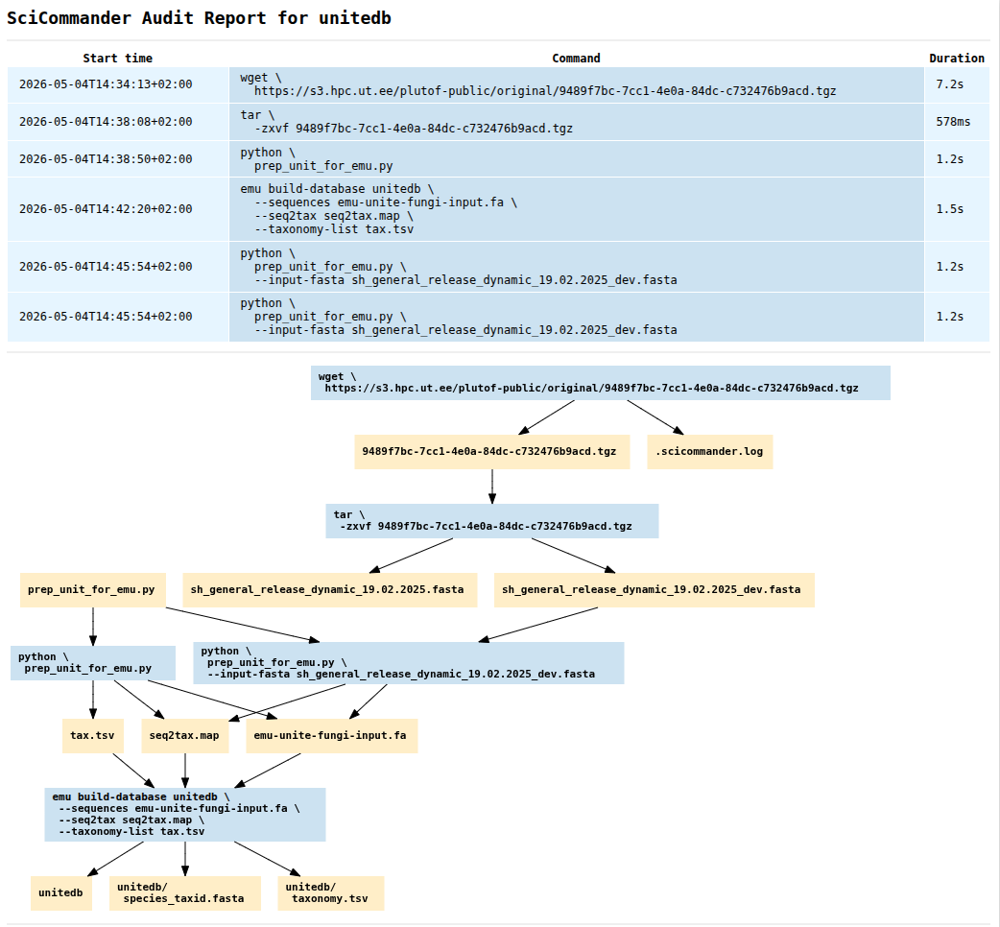

SciCommander
============

[](https://github.com/samuell/scicommander/actions/workflows/go-ci.yml)

This is a small tool that executes single shell commands in a scientifically
more reproducible and robust way, by doing the following things:

## Features

- Caching: Skipping executions where output files already exist. This greatly
  aids in iterative development of pipelines, as heavy operations early in the
  script are not needlessly re-executed.
- Auditing: Creating an audit log of all files generated via SciCommander.
- Reproducing shell script: Create a shell script that reproduces a specific
  file earlier created via SciCommander, by running exactly the commands used
  to create it, using the `sci toshell` command.
- HTML reports: Create an HTML audit report with a workflow graph, for all
  output files created via SciCommander, using the `sci tohtml` command.
  - See an example of an HTML report below:



## Roadmap

There are also some further features that are planned to be introduced further
down the road, such as:

- Atomic writes - Writes files to a temporary location (such as a sub-folder)
  until command is finished, so that you never end up with truncated data if a
  command crashes.

## Limitations

Below we list notable limitations, where it is not yet clear if we will address
them in an upcoming release:

- To get a coherent audit report, all commands producing files need to be ran
  from the same folder, so that all paths are relative to that same folder.

## News

- **June 22, 2026**: New releases: We just released
  [0.6.0](https://github.com/samuell/scicommander/releases/tag/0.6.0) with much
  improved usability.
- **Nov 13, 2025**: We recently released
  [0.5.0](https://github.com/samuell/scicommander/releases/tag/0.5.0) with much
  improved usability, and soon after
  [0.5.1](https://github.com/samuell/scicommander/releases/tag/0.5.1) with an
  important bugfix for handling outputs in subdirectories.
- **Sep 3, 2024:** A blog post and poster about the new Go version of SciCommander
  is [now published here](https://livesys.se/posts/rewrite-of-scicommander-in-go/).
- **Aug 16, 2024:** Version 0.4 released, which is a complete rewrite of the
  tool in Go, with some cool new features such as the ability to detect output
  files automatically.
- **Nov 9, 2023:** Version 0.3.3 released, with a new command, `scishell`, that
  allows you to run commands more like in a normal shell (only adding  `i:`
  before input files and `o:` before output files), instead of running it
  through a separate command, and still have the full audit trace generated.
  - Read more in [this blog post](https://bionics.it/posts/scicommander-0.3)!

## Contents

- [Features](#features)
- [Roadmap](#roadmap)
- [Limitations](#limitations)
- [News](#news)
- [Installation](#installation)
- [Usage](#usage)
- [Example](#example)
- [Quoting caveats](#quoting-caveats)

## Requirements

- A unix like operating system such as Linux or Mac OS (On Windows you can use
  [WSL](https://learn.microsoft.com/en-us/windows/wsl/about) or [MSYS2](https://www.msys2.org/))
- A Bash shell
- For graph plotting for the HTML report, you need
  [GraphViz](https://graphviz.org/) and its `dot` command.

## Installation

### Downloading a pre-built binary

This is the recommended option for most users.

1. Go to the [Releases page](https://github.com/samuell/scicommander/releases)
2. Identify the latest release
3. Look under the "Assets" section for a pre-built binary for your computer's
   hardware architecture and operating system. E.g. something with
   `linux-amd64` in the name for 64bit Linux operating systems.
4. Download the archive
5. Unpack it
6. Put the binary in a folder that is available in your `$PATH` variable, such
   as `/usr/bin`, or even better `~/bin`, if you make sure that the latter is
   included in `$PATH` (If not, you can add `export PATH=~/bin:$PATH` e.g. to
   the end of your `~/.bashrc` file and then restart your shell).
7. Done. Now you should be able to execute the `sci` command in any newly
   opened bash shell.

### Using Go

This method assumes that you have [installed the Go toolchain](https://go.dev/doc/install).

```bash
go install github.com/samuell/scicommander/cmd/sci@latest
```

This will install the `sci` command into your `PATH` variable, so that it
should be executable from your shell.

(Other installation options to be added shortly)

## Usage

To view the options of the `sci` command, execute:

```bash
sci -h
```

There are then two main ways to use SciCommander:

1. In shell mode, launched with the bare `sci` command.
2. In bash scripts, using the `sci run` command.

## Easiest: Shell mode

The simplest and easiest way to use SciCommander is via the shell mode,
where you can execute you bash commands mostly as usual, while SciCommander
makes sure they are logged to special audit files (named `.au`), which can
later be converted to beautiful html-reports.

To start the shell mode, just execute `sci` without parameters:

```bash
sci
```

Then you will see something like this:
```bash
  ___     _  ___                              _         
 / __| __(_)/ __|___ _ __  _ __  __ _ _ _  __| |___ _ _ 
 \__ \/ _| | (__/ _ \ '  \| '  \/ _' | ' \/ _' / -_) '_|
 |___/\__|_|\___\___/_|_|_|_|_|_\__,_|_||_\__,_\___|_|  
>------------------------------------------------------>

 Welcome to the SciCommander shell!
 Commands executed here will be logged for provenance.
 (Exit with Ctrl+C)

 See also the other sci sub-commands:
 > sci help
 > sci run <command>
 > sci tohtml <file.au>
 > sci toshell <file.au>
 > sci shell (default)
 (These can be executed both outside or inside the shell)

sci>
```

Then, you can run some commands, such as the following few steps where we
produce a sequence file and then compute its reverse complement.

### Create a fasta file with some DNA
```bash
sci> echo AAAGCCCGTGGGGGACCTGTTC > dna.fa
```

### Compute the complement sequence
```bash
sci> cat dna.fa | tr ACGT TGCA > dna.compl.fa
```

### Reverse the DNA string
```bash
sci> cat dna.compl.fa | rev > dna.compl.rev.fa
```

### Convert the final audit file to HTML and open in browser
```bash
sci> tohtml dna.compl.rev.fa.au
```
In other words, no extra syntax is needed.


### Forcing commands to run outside or inside of SciCommander

SciCommander has some default settings about some commands that are not run
through the SciCommander run mechanism by default, such as `ls`, `cd`, `rm`
etc. Sometimes you might want to override the default behaviour though.

To force a command to run *outside* SciCommander, in the shell mode, you can
prepend it with a `!` character, like so:

```bash
!cat myfile.txt
```

To force a command to actually run inside SciCommander (e.g. to capture
provenance for it), you can prepend the command with a `>`, like so:

```bash
>ls -ltr > folder-content.txt
```

Then you will get an audit file for this output file, `file-content.txt.au`.

## Using scicommander in scripts

To get the benefits from SciCommander in reproducible scripts on the other
hand, you need to do the following:

1. Prepend all your shell commands with the `sci run` command.
2. Wrap the command itself in quotes, either `""` or `''`. This is not strictly
   required always, but will be required for example if using redirection using
   `>` or piping with `|` (Alternatively one can just add quotes around those).
3. Then run your script as usual.

Now you will notice that if you run your script again, it will skip all
commands that have already finished and produced output files.

You will also have files with the extension `.au` for every output that you
decorated with the syntax above.

To convert such an audit report into a nice HTML-report, you can run the
following:

```bash
sci tohtml <audit-file>
```

## Example

To demonstrate how you can use SciCommander, imagine that you want to write the
following little toy bioinformatics pipeline, that writes some DNA and converts
its reverse complement, as a shell script, `my_pipeline.sh`:

```bash
#!/bin/bash

# Create a fasta file with some DNA
echo AAAGCCCGTGGGGGACCTGTTC > dna.fa
# Compute the complement sequence
cat dna.fa | tr ACGT TGCA > dna.compl.fa
# Reverse the DNA string
cat dna.compl.fa | rev > dna.compl.rev.fa
```
Now, to make the commands run through SciCommander, change the syntax in the
script like this:

```bash
#!/bin/bash

# Create a fasta file with some DNA
sci run echo AAAGCCCGTGGGGGACCTGTTC '>' dna.fa
# Compute the complement sequence
sci run cat dna.fa '|' tr ACGT TGCA '>' dna.compl.fa
# Reverse the DNA string
sci run cat dna.compl.fa '|' rev '>' dna.compl.rev.fa
```

Notice that we had to wrap all pipe characters (`|`) and redirection characters
(`>`) in quotes. This is so that they are not grabbed by bash immediately but
instead passed with the command to SciCommander, and executed as part of its
execution.

An alternative is to encapsulate the full commands in `''`:

```bash
#!/bin/bash

# Create a fasta file with some DNA
sci run 'echo AAAGCCCGTGGGGGACCTGTTC > dna.fa'
# Compute the complement sequence
sci run 'cat dna.fa | tr ACGT TGCA > dna.compl.fa'
# Reverse the DNA string
sci run 'cat dna.compl.fa | rev > dna.compl.rev.fa'
```

Now you can run the script as usual, e.g. with:

```bash
bash my_pipeline.sh
```

Now, the files in your folder will look like this, if you list them with `ls -tr`:

```bash
my_pipeline.sh
dna.fa.au
dna.fa
dna.compl.fa.au
dna.compl.fa
dna.compl.rev.fa.au
dna.compl.rev.fa
```

Now, you see that the last `.au` file is `dna.compl.rev.fa.au`.

To convert this file to HTML and view it in a browser, you can do:

```bash
sci tohtml dna.compl.rev.fa.au
```

Alternatively, to convert this file to a shell script that can reproduce this file again, execute:

```bash
sci toshell dna.compl.rev.fa.au
```

**Caveat:** Note that for both of these commands, you currently need to stand
in the same folder as where you stood when the files were initially produced,
in order for SciCommander to correctly locate upstream files (see issue
[#29](https://github.com/samuell/scicommander/issues/29)).

## Quoting caveats

Note that there are a number of caveats to think about when quoting complex commands.
Based on things we have noted ourselves, we are noting a few of them here that might
be relevant when using SciCommander:

1. Generally, use double quotes (`""`) to enclose longer strings. This is
   because strings enclosed in single quotes (`''`) can not contain escaped
   single quotes (`\'`), as these will not be escaped, but will be interpreted
   as closing the single-quoted string. This is because single quotes in Unix
   means that all the content is interpreted litterally.
2. Note though, when using double quotes, that some characters need to be escaped:
   - Any `$` needs to be escaped as `\$`
   - Any internal `"` needs to be escaped as `\"`
   - Any backslashes `\` that you want to keep, need to be escaped with another backslash: `\\`
   - This includes backslashes followed by a newline, which are otherwise removed from the string, including the newline
   - Any backticks ``` ` ``` need to be quoted as ``` \` ```

This means that a command such as:

```bash
ps aux | tr ' ' '\t' | awk -F"\t" '{ print $1 }' | sort | uniq -c | sort -nr | tee top-users.txt
```

... should typically be quoted and ran like so:

```bash
sci run "ps aux | tr ' ' '\t' | awk -F\"\t\" '{ print \$1 }' | sort | uniq -c | sort -nr | tee top-users.txt"
```

## Notes

[1] Although scientific workflow managers like [SciPipe](https://scipipe.org), [Snakemake](https://snakemake.github.io/)
and [Nextflow](https://nextflow.io/) already take care of some of the benefits, such as atomic writes, SciCommander
adds additional features such as detailed per-output audit logs. It can thus be
a great complement to these tools.
